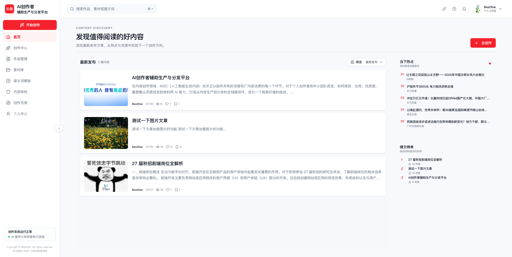

# 字节跳动2026工程训练营——前端方向今日头条业务

在内容创作领域，AIGC（人工智能生成内容）技术正以前所未有的深度和广内容消费的每一个环节。对于个人创作者和中小团队而言，如何高效、合规、优质度，重塑着从灵感迸发到地利用 AI 能力，打造从内容生产到分发的全链路闭环，成为一个极具价值的挑战。

我们设想一个平台，它不仅是创作者的得力助手，能辅助完成从创意构思、素材整合、多模态内容（如长文、短图文、种草内容等）生成的全过程，更是一个智能的“守门员”和“导航员”。它需要内建一套由 AI 驱动的内容安全与质量管控体系，在创作的各个阶段自动识别并干预潜在的合规风险，同时对内容的质量进行评估，为后续的精准分发提供决策依据。

最终，平台还应具备热点追踪和内容榜单功能，让优质内容能够脱颖而出，并为创作者提供数据反馈，形成一个从创作、审核、分发到优化的良性循环。

## 网站地址

## 功能介绍

## Bug修复
***欢迎在Issue中向我反馈Bug，我会尽快修复。***

## TODO
- 忘记密码的重制密码实现。
- 清除不再适用的组件和相关逻辑。
- 优化创作中心AI协作文章写作交互操作。
- 文章草稿的自动保存。（RAF函数实现计时器+防抖）
- 接入AI内容审查，完善内容审核工作链路。
- 接入火山方舟提供的Seed-Character，Seed-Dance，Seed-Dream，实现文生文、文生图、文生视频的多模态内容创作。
- 设计Agent架构，提取重复操作为Skills以方便复用。
- 创作灵感流程完善。
- 依托浏览量、点赞量、收藏量设置不同权重形成爆文榜单排序。