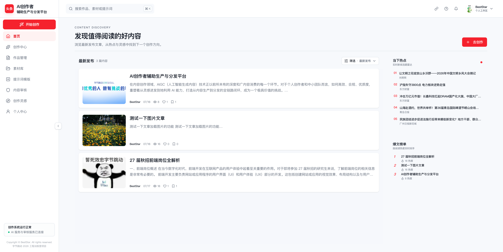

# 字节跳动2026工程训练营——前端方向今日头条业务

## 功能介绍
在内容创作领域，AIGC（人工智能生成内容）技术正以前所未有的深度和广内容消费的每一个环节。对于个人创作者和中小团队而言，如何高效、合规、优质度，重塑着从灵感迸发到地利用 AI 能力，打造从内容生产到分发的全链路闭环，成为一个极具价值的挑战。

我们设想一个平台，它不仅是创作者的得力助手，能辅助完成从创意构思、素材整合、多模态内容（如长文、短图文、种草内容等）生成的全过程，更是一个智能的“守门员”和“导航员”。它需要内建一套由 AI 驱动的内容安全与质量管控体系，在创作的各个阶段自动识别并干预潜在的合规风险，同时对内容的质量进行评估，为后续的精准分发提供决策依据。

最终，平台还应具备热点追踪和内容榜单功能，让优质内容能够脱颖而出，并为创作者提供数据反馈，形成一个从创作、审核、分发到优化的良性循环。


## 网站地址
[www.startiao.cn](http://www.startiao.cn)

### 项目文档
- [创作与内容审核 Agent 架构](./docs/AGENT_ARCHITECTURE.md)
- [AI Agent 架构面试八股与项目深挖](./docs/AI_AGENT_INTERVIEW_GUIDE.md)
- [AIGC 平台全栈面试深挖](./docs/INTERVIEW_DEEP_DIVE.md)
- [RustFS 对象存储说明](./docs/RUSTFS_STORAGE.md)
- [MongoDB Agent 轨迹存储](./docs/MONGODB.md)

## 本地启动
请首先分别完成PostgreSQL、MongoDB、RustFS的安装和配置，确保它们在本地可用。
### 前端
```bash
cd client
pnpm install
pnpm run dev
```

### 后端
```bash
cd server
pnpm install
pnpm run dev
```

### RustFS
```bash
rustfs server \
  --address :9000 \
  --console-enable \
  --console-address :9001 \
  --access-key YOUR_ACCESS_KEY \
  --secret-key YOUR_SECRET_KEY \
  --region us-east-1 \
  YOUR_LOCAL_STORAGE_PATH
```

## Bug修复
***欢迎在Issue中向我反馈Bug，我会尽快修复。***
